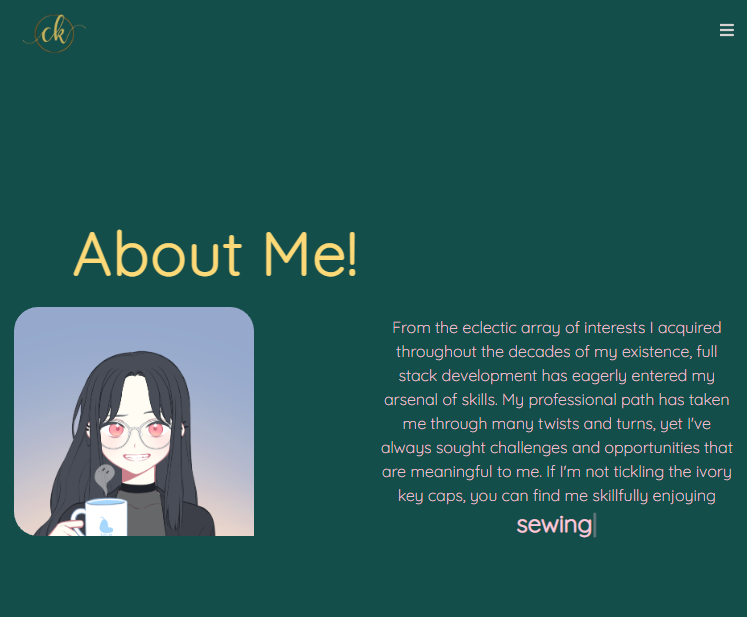
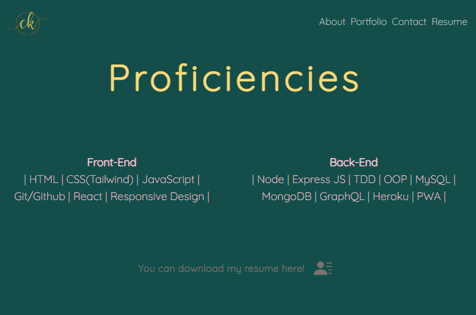

# Welcome to my REACT portfolio

# Snapshots

# Table of Contents
* [Description](#description)
* [Installation](#installation)
* [Packages Used](#packages-used)
* [Contact](#contact)

# Description
 Show casing my knowledge of REACT with a display of my portfolio. Check it out [here!](https://vaalchemist.github.io/portfolio-imnida/)

# Installation

* Download or clone repository
* Use a text editor to view all coding, Visual Studio Coding is recommended.
* Within the command line:
   * Open up the <code>Command line</code> within VS code
   * Run: <code>npm init -y</code>
   * Followed by: 
       * <code>npm install</code>
   * Run react app: <code>npm start</code>

# Packages Used
  * TailwindCSS
  * React router
 
# Contact
<a href="https://github.com/VAalchemist">Github: VAalchemist</a>

[Return to top](#welcome-to-my-react-portfolio)
